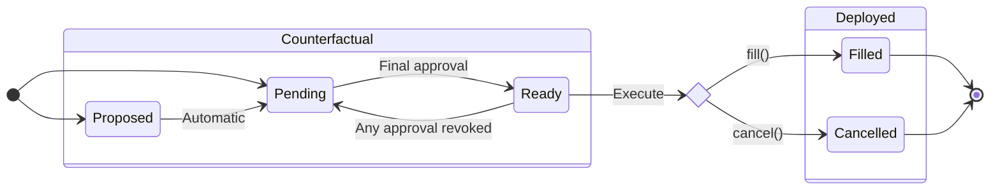
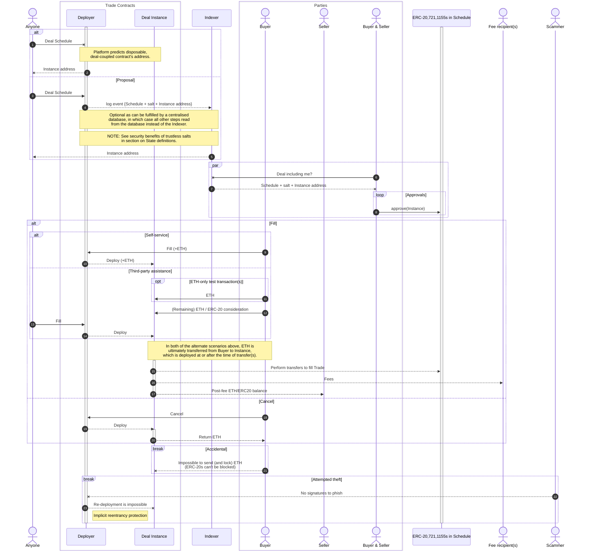

# SWAP2 Design

## Summary

SWAP2 is a protocol for OTC NFT trading using ephemeral, CREATE2-deployed contracts with minimal gas overhead.
Single-use contracts, cryptographically coupled to specific trades, limit `ERC721.setApprovalForAll()` to a least-privileges scope and also automatically expire after use.
The need for per-trade approvals is a deliberate design trade-off to provide increased security for high-value, low-volume trades.

## Requirements

1. Improved security over current OTC options (see [threat model](#threat-model)).
2. Comparable or less gas compared to Sudoswap OTC and Seaport (for the supported trade types).
3. Ability for a third party (e.g. a broker) to set up the parameters of a trade.
4. Support for non crypto-native buyers (with assistance):
   * Some buyers may be investors from non-crypto backgrounds (e.g. traditional art world) and will be assisted by brokers.
   * At least one broker of such historical deals has found a need to accept ETH simply sent to an address (in their case, acting as an escrow service).
   * There is significant risk of fat-fingering amounts or sending to the wrong address, so they have previously accepted "test" (negligible value) transactions, which still needs to be possible.
   * Such trades SHOULD be a last resort, preferring ERC20 approvals to allow for full automation.

## Threat model

### General attack vectors

#### Unrevoked approvals

Non-custodial marketplace and OTC-swap contracts can only transfer tokens through approval mechanisms.
For 721 and 1155 tokens, this is typically achieved via `setApprovalForAll()` even though only one or some tokens are to be traded.

Best practice requires the owner to revoke these permissions after the trade, and websites like [revoke.cash](https://revoke.cash) assist in tracking outstanding approvals.
However people either forget to do so or have pending trades from the same collection, requiring ongoing permission.

#### Off-chain signature phishing

Once a contract has been approved to transfer tokens, an extra gating mechanism must be in place to confirm the owner’s intent to trade.
While this can be achieved through an on-chain record, it typically takes the form of an off-chain signature as this doesn’t require any gas to be spent.

Off-chain signatures are, however, easier to phish and harder to trace.
The use of such signatures for other actions (e.g. site login) reduces user vigilance, making them far more likely to sign anything requested by a malicious website—wallets typically don’t warn about these either.
Furthermore, their off-chain nature makes them extremely hard to trace and users may be left with lingering doubts over what they’ve inadvertently signed.

#### Case study

The combination of the two [attack vectors](#general-attack-vectors) are what led to the [theft of over $1M in NFTs from Kevin Rose](https://www.coindesk.com/web3/2023/01/25/kevin-rose-says-nft-wallet-with-dozens-of-high-value-collectibles-hacked/).
The primary author of SWAP2 was on a call with Kevin when this happened and was heavily involved in the investigation.
Having recently listed a Chromie Squiggle for sale, Kevin was vulnerable due to unrevoked approvals, and fell victim to a phishing attack for OpenSea-compatible signatures.

### Mitigation of general attack vectors

The goal of the typical approval+signature approach is to prove that an asset owner has an intent to undertake a specific trade.
The _approval_ step proves intent to trade under a set of _general_ rules (the contract logic) while the _signature_ proves agreement with (the hash of) _specific_ trade parameters.

SWAP2 combines both steps. Solidity constructors have their arguments appended after the deployment code, and [CREATE2 addresses](https://eips.ethereum.org/EIPS/eip-1014) are determined (in part) from the hash of this concatenated buffer. If a user (willingly) approves such an address we can therefore establish equivalent proof of intent to trade their assets.

With respect to signing (transactions or otherwise), the residual risk for SWAP2 contracts is therefore no different to baseline when compared to approving an arbitrary EOA.
This design therefore achieves requirement (1) of reducing phishing risk although at the expense of requirement (2) due to per-trade approvals.

### SWAP2 attack vectors

Hash security plays a greater role in SWAP2 than it does in typical approval+signature approaches because of the reduced output size of 160-bit addresses.

An adversary with full control over CREATE2 inputs could lock a set of NFTs for sale while finding two different ETH amounts that result in the same counterfactual address.
Collision resistance amounts to a birthday problem, limiting the security level to ~80 bits.
For context, the [Bitcoin hash rate](https://www.blockchain.com/explorer/charts/hash-rate) is around 650e18 hashes/sec, or [approximately half an hour](https://www.wolframalpha.com/input?i=%282%5E80+%2F+650e18%29+seconds) to perform 2^80 hashes.

Although this is still highly unlikely, [NIST recommends against 80 bits of security](https://csrc.nist.gov/glossary/term/security_strength#:~:text=a%20security%20strength%20of%2080%20bits%20is%20no%20longer%20considered%20sufficiently%20secure).
We can achieve this by securely choosing the CREATE2 salt _after_ agreeing to trade details, returning to 160 bits due to second-preimage resistance.

> [!CAUTION]
> To provide 160-bit security, CREATE2 salts MUST be deteremined after agreeing to specifics of a trade.
> Without this, the security guarantee is halved to 80 bits.

## Terminology

1. **Trade** / **Swap**: the act of exchanging one set of assets for another.

2. **Party**:
   1. **Buyer**: the participant in a Trade (optionally) providing ETH/ERC20 as **Consideration**; or
   2. **Seller**: the counterparty to the Buyer in the Trade.
   * If no ETH/ERC0 is being used as Consideration then either participant can take on either role.

3. **Deal**: particulars / **Schedule** of a proposed or executed Trade, including Parties and assets.
   1. The code has diverged from this specific terminology, encoding a Deal as a `struct <T>Swap`, not a `<T>Deal`, where `<T>` describes the broad asset categories.

5. **Instance**: a specific incarnation of a Deal, coupled to an unambiguous (counterfactual) contract address.
   * More than one Instance may share an identical Deal Schedule; e.g. if one is cancelled and later recreated. Two such Instances differ only in their [CREATE2 salts](https://eips.ethereum.org/EIPS/eip-1014).
   * For the most part, Deal and Instance can therefore be used interchangeably and this is done (even if incorrect) if being explicit would add unnecessary confusion.
   * Code (primarily the tests) generally refer to an instance as `address swapper`.

6. **Deployer** / **Factory**: a contract capable of deploying Instances and predicting their deployed addresses.

7. **Execute** (a Deal):
   1. **Fill**: perform the Trade outlined by the Deal Schedule; or
   2. **Cancel**: permanently void a Deal Instance.

> [!NOTE]
> Execution of a Deal occurs in the constructor of the Instance contract.
> Deployed contracts are minimal artifacts of only a few bytes.

### States

An Instance can be in any of the following states:

1. **Proposed**: an optional pseudo-state in which the Instance address is emitted as a contract event.
2. **Pending**: awaiting at least one (ERC20/721/1155) approval of the Instance address.
3. **Ready**: not awaiting any approvals, but not yet Executed.
4. **Filled**: _as defined in Terminology_.
5. **Cancelled**: _as defined in Terminology_.

> [!IMPORTANT]
> Although the Proposed state is optional, there are [important security benefits](#swap2-attack-vectors) that go beyond merely computing the predicted address in a trusted manner.

## Sequence diagram

This diagram provides a high-level overview of the entire user experience for all participants, beyond just the smart contracts.
Where possible, standard diagram semantics are used, but some are modified for blockchain-specific behaviour.

* Lines:
  * Solid: the participant initiated an action.
  * Dotted: the participant's action was a consequence of another's (e.g. event logging or return value).
* Heads:
  * Arrow: transaction (i.e. included in the blockchain).
  * X: read-only call (i.e. no change in blockchain state).
* Contract existence:
  * A solid bar over a contract's vertical line indicates an already-deployed contract.
  * The lack of a solid bar:
    * _Before_ deployment indicates a counterfactual (hypothetical) contract with predictable address; and
    * _After_ deployment indicates that the deployed code is a minimal artifact, incapable of performing actions (i.e. all actions are performed in the constructor).

---

